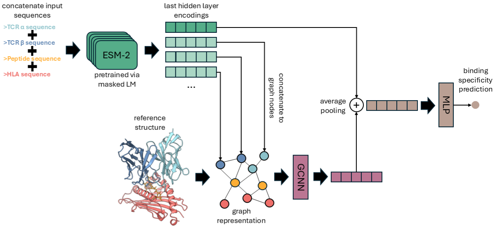

# STAG-LLM

This repository contains the code for STAG-LLM, a novel model for predicting TCR-pMHC binding specificity by integrating sequence information from a pre-trained Large Language Model (ESM-2) with structural insights captured by a Graph Neural Network (GNN).

## Model Architecture

The STAG-LLM model combines sequence embeddings generated by a fine-tuned ESM-2 model with graph representations derived from TCR-pMHC structures. These two modalities are then combined for binding specificity prediction.



## Data Preparation

**IMPORTANT:** Before running any code, you must download the `data` folder, which contains the raw input data for the project. Please download it from [data](https://rice.box.com/s/xin5ogk1gfwm4wu9i96wsx0497vz0plz) and place it in the root directory of this project.

After downloading the `data` folder, you need to unzip and preprocess the PDB files to convert them into graph representations that can be used by the model.
Run the `pdbs_to_graphs.py` script:

   ```
   python pdbs_to_graphs.py
   
   ```

## Training the Model

To replicate the experiments from the paper and train the STAG-LLM model from scratch:

```
python train.py

```

Training progress and evaluation metrics will be logged in the `test` directory (or the directory configured in `train.py`).

## Using Pretrained Models for Evaluation

Pretrained models are provided in the `pretrained_models` directory. Please download it from [pretrained_models](https://rice.box.com/s/k2f0waqrj66a35lobhfcctz1fy3ges05) and place it in the root directory of this project. You can use these models to score individual input PDB files or evaluate on a test set.

1. Place your input PDB files in a designated directory.

2. Run the `evaluate.py` script:

   ```
   python evaluate.py --model_path path/to/your/pretrained_model.pt --pdb_file path/to/your/input.pdb
   
   ```

## Project Structure

```
.
├── data/
│   ├── full_seq_df_new.csv
│   └── final_dataset_modeled.csv
│   └── top_structures.zip (pdb data files)
├── hetero_edge_graphs/ (generated by pdbs_to_graphs.py)
├── pretrained_models/
│   └── ... (pretrained model checkpoints)
├── requirements.txt
├── train.py
├── model.py
├── data_handling.py
├── utils.py
├── pdbs_to_graphs.p
└── evaluate.py
├── README.md
├── STAG_LLM_image.png (image asset)
```

### We have compared our approach to five models from the literature. 
* For the STAG model, please visit [STAG](https://github.com/KavrakiLab/STAG_public)
* For the netTCR 2.2 model, please visit [NetTCR 2.2](https://github.com/mnielLab/NetTCR-2.2)
* For the TCR-ESM model, please visit [TCR-ESM](https://github.com/dhanjal-lab/tcr-esm)
* For the ERGO II (AE and LSTM), please visit [ERGO-II](https://github.com/IdoSpringer/ERGO-II)
